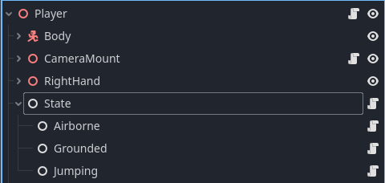
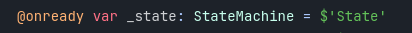
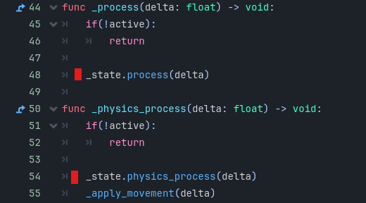
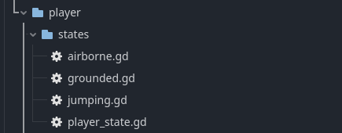
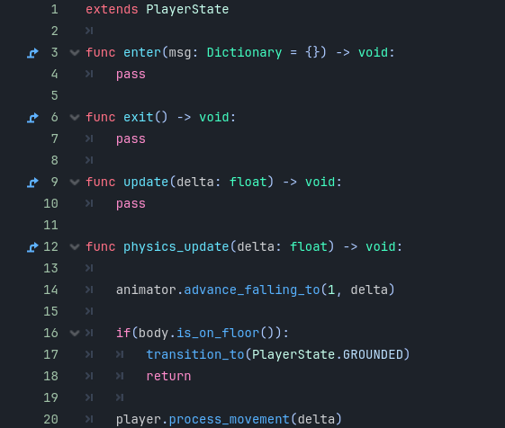

# Coding Guide

This document describes some general rules and gives a guide on how to structure the code for this project. As a base please make use of the Godot best practices. For a more indepth guide please take a look at [Godot best practices](https://docs.godotengine.org/en/stable/tutorials/best_practices/introduction_best_practices.html).

## Naming

Folder names   -> snake_case
File names       -> snake_case
Class names     -> PascalCase
Node names    -> PascalCase

## State machine

The existing StateMachine Class should be used to design various states. The needed ".gd" script files can be found under "src/utility/state_machine". An implementation example can be found under the "src/scenes/player" player scene. The states will be configured using nodes.

### Setup

As state root, add a new node and attach the "state_machine.gd" script. In the editor on that node you can configure the initial state and the stack size which will be explained later under this segment. (Leave at 0 if unsure)
This root node will be used to manage the state outside of the Statemachine.

For the StateMachine to function you need to call its "process" and "physics_process" method. Example of inside the "player.gd".

Now you can configure as many states as subnodes as necessary. Just add a new node and with it its own code file.

Inside every states code, extend the "State" class or a wrapper that includes data like in the example of "PlayerState".
You can then override the lifetime hooks of the state to add functionality. Using the "transition_to" method and passing a NodePath you can transition between states. Example of all of the lifetime hooks:

